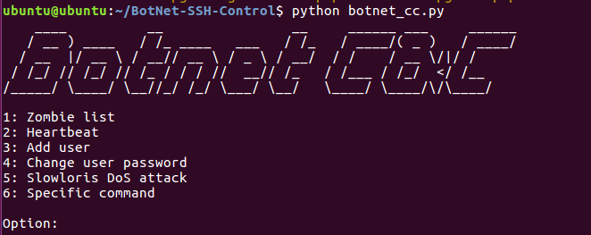

# BotNet-SSH-Control
Botnet Command and Control (C&amp;C) controlled via SSH using the Paramiko library.

## Usage

Add the username, password and IP address of every system in *"ssh_users.txt"* file. Then, run:

```
python botnet_cc.py
```


## Requirements

Python 2.x:

```
pip install -r install/requirements.txt
```

Python 3.x:

```
pip3 install -r install/requirements.txt
```


## Options

- 1: Zombie list - Show the IP addresses of the systems in *"ssh_users.txt"*

- 2: Heartbeat - Ping (1 packet) to all the systems in *"ssh_users.txt"*

- 3: Add user - Add a new user in the systems

- 4: Change user password - Change the password of a user in the systems

- 5: Slowloris DoS attack 

- 6: Specific command - It runs as superuser (it is not necessary to add "sudo...")





## Note

Tested both in Python2.x (2.7.15rc1) and Python 3.x (3.6.7)
